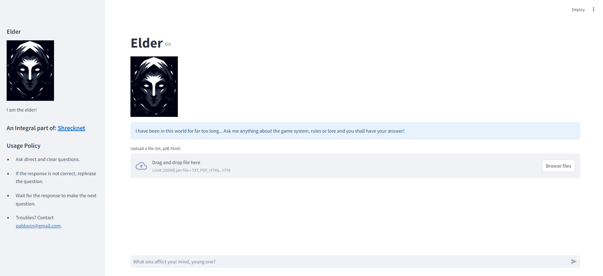
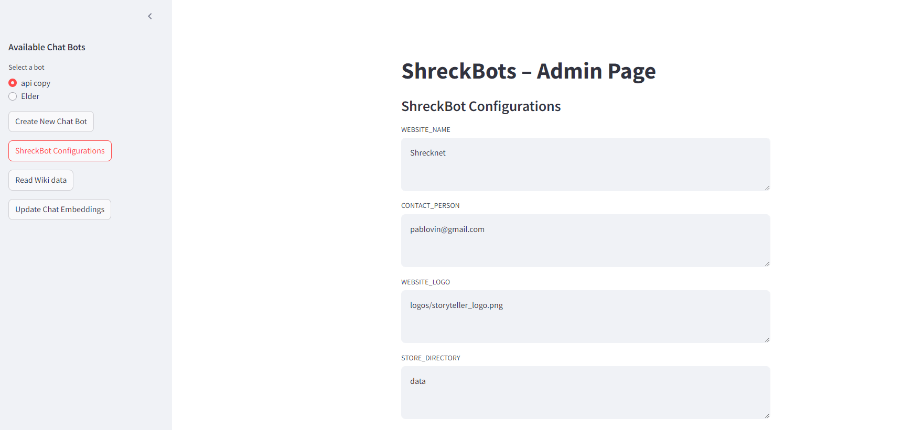
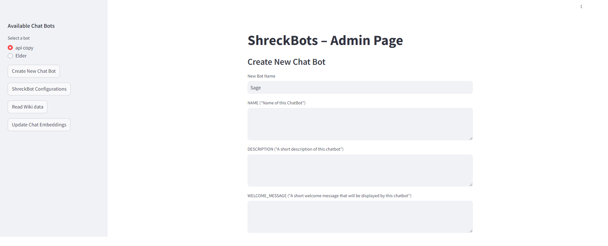
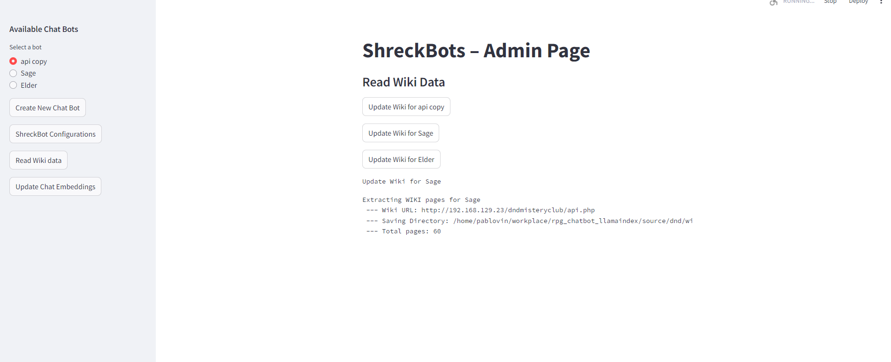
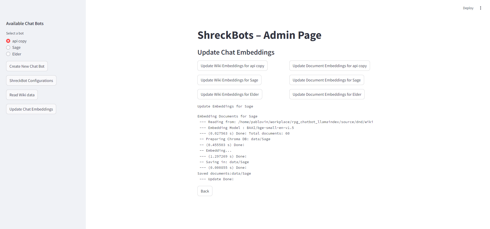

# Shreckbots

## Overview



This project is a chatbot management system based on Streamlit and Llama-index that allows users to create chatbots, manage them and interact with them.

The chatbots use a Retrieval Augmented Generation (RAG) architecture, powered by Llama-index, to gather knowledge from text files or a media wiki website.

It then uses OpenAI ChatGPT or Ollama to serve an LLM to consume this knoweldge, and interact with different users.

This project started as a system to help on organizing my role-playing gaming sessions, but was extended to support any generic scenario.

When combined with a MediaWiki access, it is an ideal solution for the consumption, interpretation and transformation of collaborative knowledge.
PT or Ollama. The chatbot is capable of handling various queries and providing context-based responses.

## Features

- Supports multiple LLMs including OpenAI's GPT and Ollama.
- Utilizes HuggingFace embeddings for better context understanding.
- Stores chat history for personalized interactions.
- Customizable chat templates and settings.
- Extract knowledge from a MediaWiki website.

## Setup

### Prerequisites

- Python 3.10+
- Required Python packages (listed in `requirements.txt`)
- (optional) A runing and configured [Mediawiki](https://www.mediawiki.org/) instance with acess to the api.php functionality

### Installation

1. **Clone the repository:**

    ```sh
    git clone https://github.com/pablovin/Shreckbots.git
    cd Shreckbots
    ```

2. **Create a virtual environment and activate it:**

    ```sh
    python -m venv venv
    source venv/bin/activate   # On Windows, use `venv\Scripts\activate`
    ```

3. **Install the required packages:**

    ```sh
    pip install -r requirements.txt
    ```

### Configuration

First of all, you have to run the Shreckbot server without any chatbot, as there are no chatbot configured:

    ```sh
    python api.py no_bots
    ```

#### 1) Setup the environmental variables.

Open the admin page: 

    ```sh
    streamlit run admin.py
    ```

Access the Shreckbot Configurations and fill the required information accordingly.




#### 2) Create a mew chabot

Access the Create New Chatbot and fill the required information accordingly.




#### (Optional) Read Wiki data

If you want to read data from a Mediawiki instalation, you can access the Read Wiki Data menu.
Click the Update Wiki [ChatBot] to start the process to read data from the wiki



Wait until the "Update Done" message is shown.

#### 3) Create/Update the source file embeddings


Add the text files (.PDF and .txt files) into the The SOURCE_[CHATBOT]/books directory.

If you read a wiki data for this chatbot in specific, it will create a folder named SOURCE_[CHATBOT]/wiki and copy all the wiki data to there.

Now you can click on the Update Wiki Embeddings (if needed) and on the Update Document Embeddings button



Wait until the "Update Done" message is shown.


### Usage

The Chatbot configuration is now done. To use the chabots, you have to stop the current Shreckbots server and run it again, now serving the available bots:

    ```sh
    python api.py
    ```

Then run the chatbot interface via streamlit:

```sh
python -m streamlit run web/chatbot/chatbot.py
 ```

 

Now you can ask any question to the chabot.
You can also upload .txt or .pdf files, and they will be added to your querry.